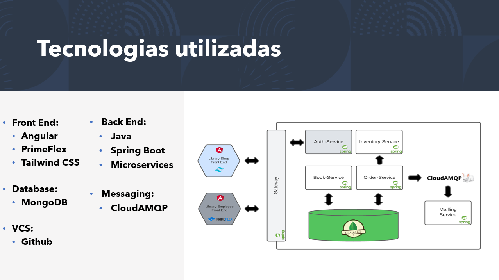

# library-2.0

> Back-end em microserviços para um ecommerce de livros, inclui compras e gerenciamento de estoque!

### Ajustes e melhorias

O projeto ainda está em desenvolvimento e as próximas atualizações serão voltadas nas seguintes tarefas:

- [ ] Implementar Resilience4j como Circuit Breaker para os microserviços
- [ ] Terminar classes de Teste unitario
- [ ] Implementar Zipkin para Distributed Tracing
- [ ] Dockerizar os microserviços
- [ ] Implementar monitoramento com Prometheus & Grafana
- [ ] Criar pipeline CI/CD no azure DevOps para deploy em nuvem

## 📝 Diversos

Repositorios do Front-End

Repositorio back-end antigo

## ☁️ On cloud
Os dois front ends desta apliciação estão disponiveis para acesso nestes links

- https://library-stock.azurewebsites.net Front for Enterprise

- https://library-jwba.azurewebsites.net Front for Shopping

Lembrando que para os front-ends funcionarem corretamente no momento esta aplicação backend deve estar rodando localmente!
 
[⬆ Voltar ao topo](#nome-do-projeto) 
